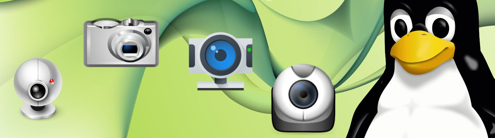

<p align="center"></p>
<h1 align="center"> WebCam testing Rasbian UbuntuServer and ROS </h1> 
<h4 align="right">March 24</h4>


<br>

# Test camera USB Webcam
```
sudo apt-get-update && sudo apt full-upgrade -y
```

Check info webcam USB:
```
ls /dev/video*
lsusb
```

RPI About the Camera Modules info: https://www.raspberrypi.com/documentation/accessories/camera.html#libcamera-and-libcamera-apps

# Taking Photos
```
libcamera-jpeg -o image.jpg
```
```
raspistill -o testshot.jpg
```

### fswebcam
```
sudo apt install fswebcam -y
```
testing:
```
fswebcam image.jpg
```
```
fswebcam --device /dev/video1 image.jpg
```


### ffmpeg
```
sudo apt install ffmpeg -y
ffmpeg -f v4l2 -video_size 1280x720 -i /dev/video0 -frames 1 out.jpg
```

> :memo: **Note:** You can set the device to use for recordings with the fswebcam software with the --device flag. For example, to take an image with the second connected USB webcam using fswebcam:


> :memo: **Note:** ```Para revisar image``` usar WinSCP en windows / SCP commands on linux

<br>

# Recording Video
To capture a 10 second video with your Raspberry Pi camera module
```
libcamera-vid -t 10000 -o video.h264
```
## ffmpeg
```
sudo apt install ffmpeg -y
```
```
ffmpeg -f video4linux2 -framerate 60 -video_size 1920x1080 -input_format mjpeg -i /dev/video0 -f alsa -i hw:1 output.mp4
```

<br>

# Testing from GUI Ubuntu
Application ```cheese```

<br>

# Testing from Browser
https://es.webcamtests.com/

<br>

# Install usb_cam ROS Package
https://github.com/carjavi/ROS-web-video-server

<br>

# Video Streaming Using Python OpenCV/ UDP protocol/ Socket Programming
https://github.com/carjavi/video-streaming-python-openCV-UDP-socket

<br>

# Webcam on ROS Node
https://github.com/carjavi/raspicam_node

<br>

# Streaming WebCam Pi
https://github.com/carjavi/raspberry-pi-code/tree/main/streaming-webcam-pi

<br>

---
Copyright &copy; 2022 [carjavi](https://github.com/carjavi). <br>
```www.instintodigital.net``` <br>
carjavi@hotmail.com <br>
<p align="center">
    <a href="https://instintodigital.net/" target="_blank"></a>
</p>


